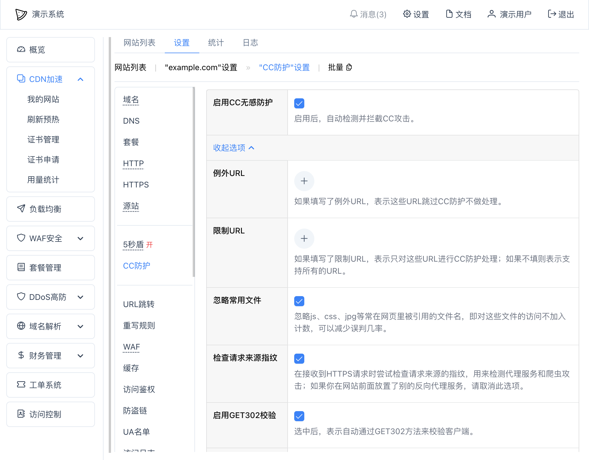

# CC防护

## 简介
高级版本的CC防护功能可以用来快速开启CC防护功能。

## 设置
可以在网站“设置” -- “CC防护”中开启：

点开“更多选项”：

其中：
* `启用CC无感防护` - 是否启用CC防护，启用后，自动检测并拦截CC攻击
* 更多选项
  * `单IP最低QPS` - 当某个IP在1分钟内平均QPS达到此值时，才会触发CC防护；如果设置为0，表示任何访问都会触发
  * `例外URL` - 如果填写了例外URL，表示这些URL跳过CC防护不做处理；比如API类的调用不做限制，可以填入 `/api/*`
  * `限制URL` - 如果填写了支持URL，表示只对这些URL进行CC防护处理；如果不填则表示支持所有的URL；比如只想针对搜索URL进行CC防护，可以填入  `/search*`
  * `检查请求来源指纹` - 在接收到HTTPS请求时尝试检查请求来源的指纹，用来检测代理服务和爬虫攻击；如果你在网站前面放置了别的反向代理服务，请取消此选项
  * `启用GET302校验` - 选中后，表示自动通过GET302方法来校验客户端；适用于网页类的应用，不适用于API应用
  * `使用自定义阈值` - 是否使用自定义阈值，默认情况下，会使用系统内置的规则，如果想自己修改，可以选中此选项，并根据自己的需要填入各个时间范围内的请求数限制

