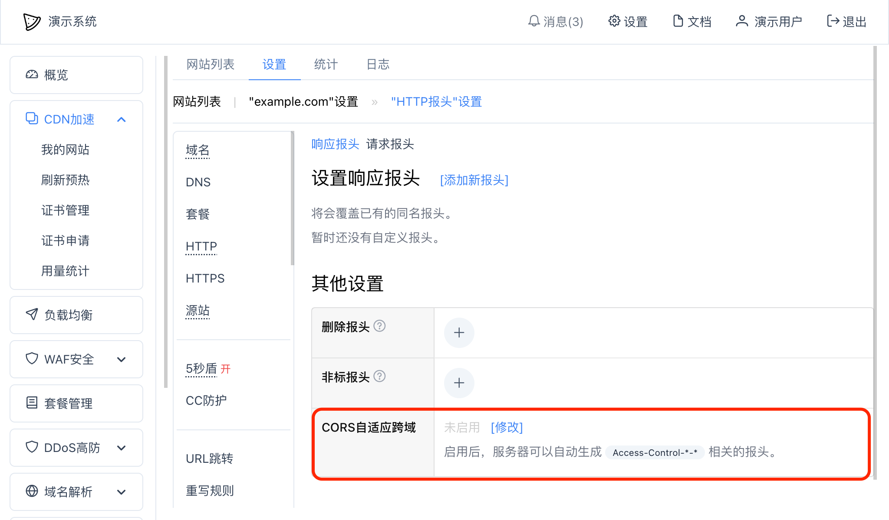
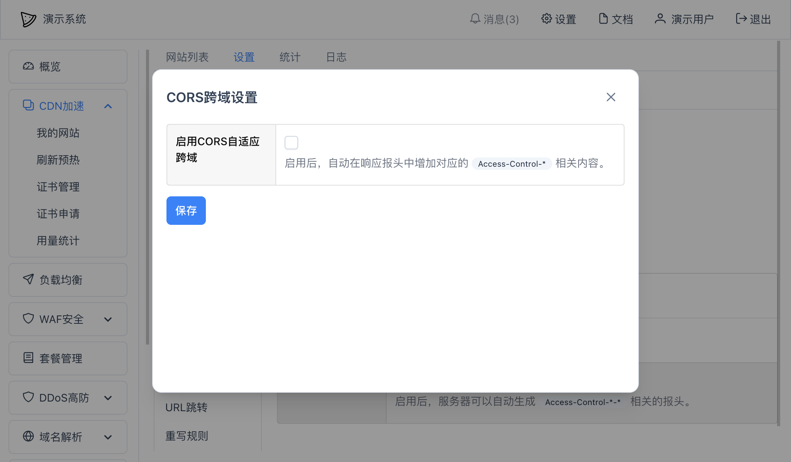
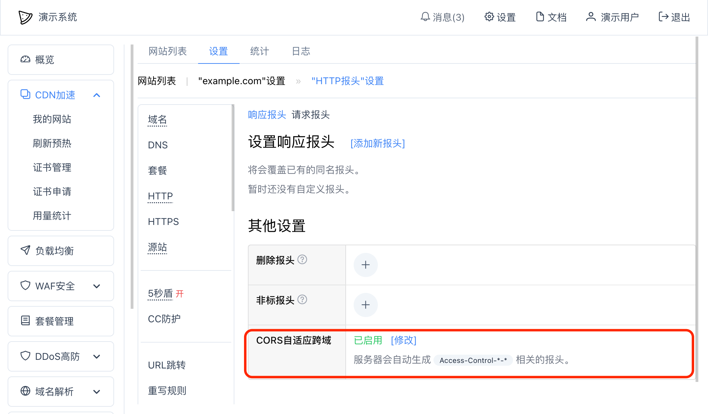

# CORS跨域设置

## 问题
在跨域访问网站时经常会遇到被CORS策略拦截问题，浏览器控制台上会出现类似于以下的提示：
~~~
Access to XMLHttpRequest at 'http://example.com/post' from origin 'http://example.com:2345' has been blocked by CORS policy: No 'Access-Control-Allow-Origin' header is present on the requested resource.
~~~

## 解决方案
在对应网站"设置"中 -- "HTTP报头"设置 -- "响应报头"中修改"CORS自适应跨域"：

点击上图中的"修改"按钮，弹出窗口：

选中"启用CORS自适应跨域"，并"保存"，其他选项通常不需要修改，界面会出现"已启用"：

这样在客户端访问网站时响应报头会自动增加以下内容：
~~~yaml
Access-Control-Allow-Credentials: ...
Access-Control-Allow-Methods: ...
Access-Control-Allow-Origin: ...
Access-Control-Expose-Headers: ...
Access-Control-Request-Method: ...
~~~

CORS跨域设置中更多选项说明（除非你对CORS策略非常了解，否则不要轻易修改这些选项）：
* `允许的请求方法列表` - `Access-Control-Allow-Methods`值设置。所访问资源允许使用的方法列表，不设置则表示默认为`PUT`、`GET`、`POST`、`DELETE`、`HEAD`、`OPTIONS`、`PATCH`
* `预检结果缓存时间` - `Access-Control-Max-Age`值设置。预检结果缓存时间，0或者不填表示使用浏览器默认设置。注意每个浏览器有不同的缓存时间上限
* `允许服务器暴露的报头` - `Access-Control-Expose-Headers`值设置。允许服务器暴露的报头，请注意报头的大小写
* `实际请求方法` - `Access-Control-Request-Method`值设置。实际请求服务器时使用的方法，比如`POST`
* `仅OPTIONS有效` - 选中后，表示当前CORS设置仅在OPTIONS方法请求时有效，其他方法响应报头中不会出现这些跨域相关报头

## 常见问题
### 为什么直接在响应报头中添加 `Access-Control-Allow-Origin: *` 仍然会提示错误？
因为在请求响应交互过程中有Cookie等验证信息时，浏览器来源站点列表（`Access-Control-Allow-Origin`）中不允许使用星号（`*`）通配符，所以在任何情况下请使用本文中"CORS自适应跨域功能"，会自动处理这种情况。