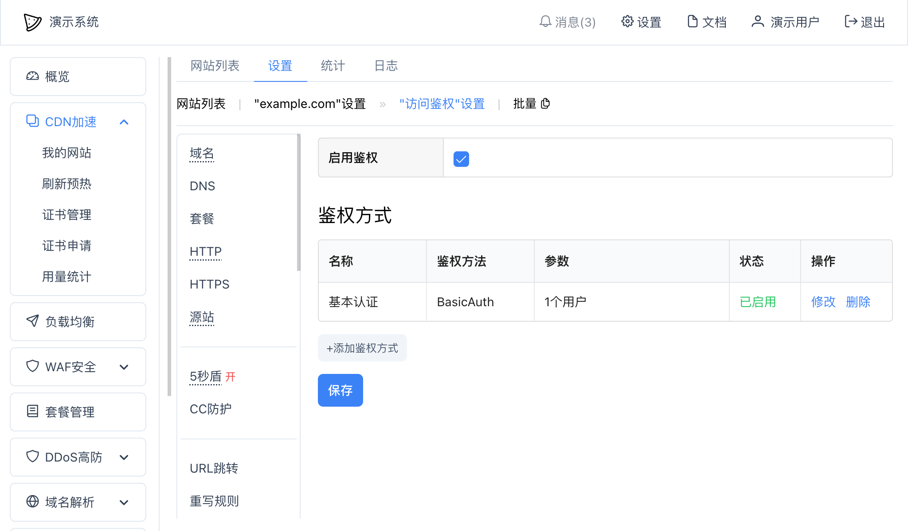
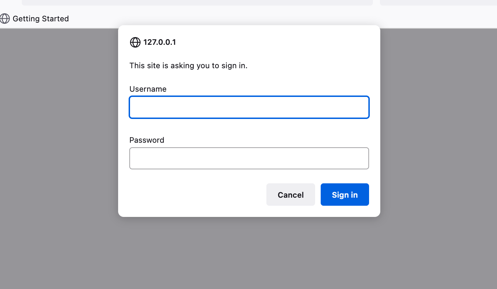
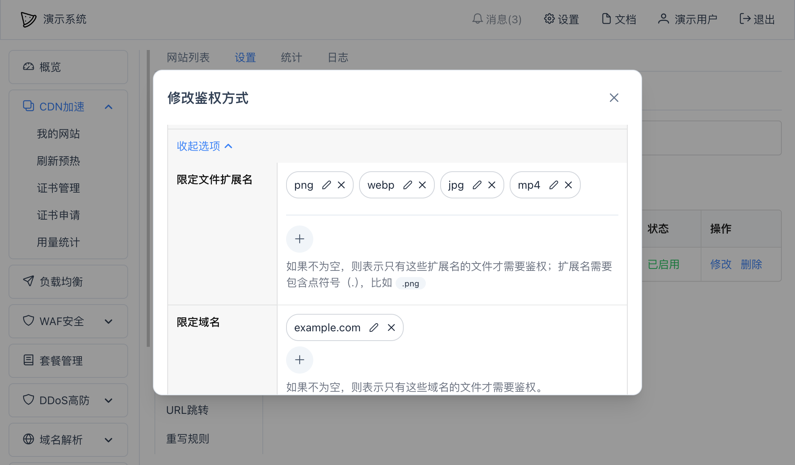

# 访问鉴权

可以使用访问鉴权功能，来限制用户对某些资源的访问，或者防止恶意用户盗刷资源，降低网站的无效带宽损耗。

* [URL鉴权方式A](http-auth-type-a.md)
* [URL鉴权方式B](http-auth-type-b.md)
* [URL鉴权方式C](http-auth-type-c.md)
* [URL鉴权方式D](http-auth-type-d.md)

## 设置
以"基本认证"鉴权为例，在网站"设置"--"访问鉴权"页面中，选择"启用鉴权"，然后点击"添加鉴权方式"按钮，创建一个新的鉴权方式，比如"基本认证"：

这样，当用户访问网站时就会在浏览器端弹出基本认证窗口：

输入我们刚才在创建鉴权方式时添加的用户名和密码就可以登录访问我们的网站资源。

### 限定文件类型和域名
你可以在某个鉴权方式中--"更多选项"中来限定文件扩展名和域名：

在上图中的示例中，我们限定了只有文件扩展名`.png`、`.jpg`、`.jpeg`、`.mp3`、`.mp4`，并且域名为 `example.com` 才会启用鉴权；其他文件扩展名的或者其他域名的，都将会直接放行。

## 多个鉴权方式
如果添加了多个鉴权方式，那么只有第一个启用的鉴权方式是有效的。

## 关闭鉴权方式
你可以取消"启用鉴权"的勾选，并保存，即为取消访问鉴权。

## 鉴权失败
如果失败，将会返回 `401 Unauthorized`，并在访问日志中标记鉴权失败时的鉴权方式。
