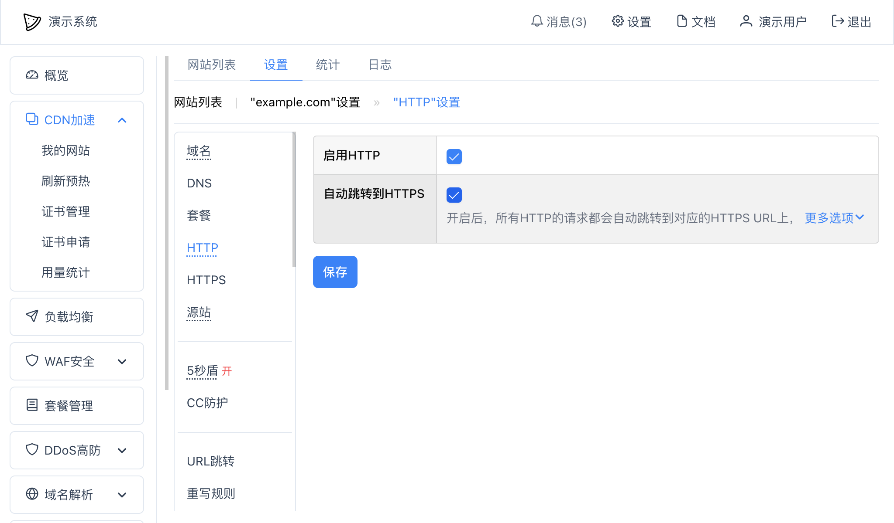

# 网站HTTP设置
一个服务需要开启HTTP设置后才能使用`http://`开头的网址访问。

在网站"设置" -- "HTTP"里：

* 启用HTTP：选中后才会启用HTTP服务；
* 自动跳转到HTTPS：开启后，所有HTTP的请求都会自动跳转到对应的HTTPS URL上，默认所有的域名访问`http://`开头的网址时都会自动跳转到`https://`地址上，可以点击"更多选项"设置这个行为；
  * 更多选项：
    * 状态码：跳转使用的HTTP状态码；
    * 跳转后域名或IP地址：指定跳转后的HTTPS的域名或者IP地址，默认和用户正在访问的域名或IP地址一致，不填写就表示使用当前的域名；
    * 端口：跳转后的端口号，默认为443；
    * 允许的域名：允许跳转的域名，如果填写了允许的域名，那么只有这些域名可以自动跳转；
    * 排除的域名：不允许跳转的域名，如果填写了排除的域名，那么这些域名将不跳转。