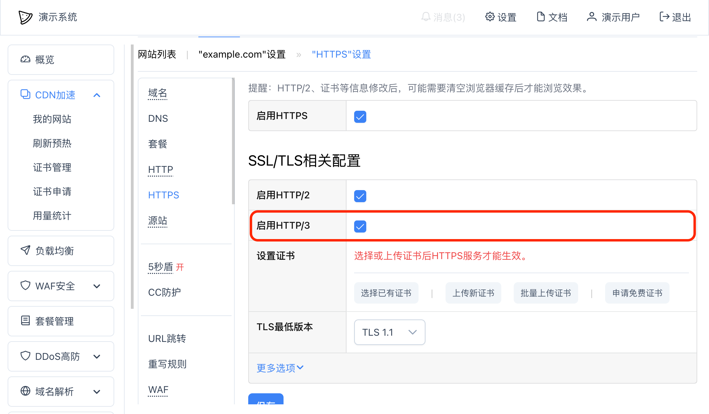

# HTTP/3

## 启用网站HTTP/3功能
要想启用单个网站HTTP/3功能，你需要：
* 你已经启用了网站的HTTPS功能，并上传了对应的SSL证书；
* 在网站设置 -- HTTPS页面点击"启用HTTP/3"，并保存，如果没有这个选项，说明你没有在对应的集群中启用HTTP/3功能。

## 测试
前提是你已经启用了浏览器的quic功能（以下介绍可能根据浏览器语言设置不同而有不同的描述）：
* `Google Chrome` - 在浏览器上访问 `chrome://flags/#enable-quic`，找到"Experimental QUIC protocol"，并启用之（Enabled）
* `Microsoft Edge` - 在浏览器上访问 `edge://flags/#enable-quic`，找到"Experimental QUIC protocol"，并启用之（Enabled）
* `Firefox` - 在浏览器上访问 `about:config`，然后搜索"network.http.http3.enable"，并点击对应行末尾的切换图标，启用之（true）
* `Safari` - 最新版本的Safari已经自动支持HTTP/3，无需任何额外配置

浏览器设置后，可能需要清理浏览器缓存并重启后才能生效。

在网站中启用HTTP/3功能后，可以在浏览器正常访问你的网站域名，并在浏览器控制台（通常是F12快捷键）观察访问使用的协议（Protocol），如果显示h3或者HTTP/3，就说明你已经成功启用了网站的HTTP/3功能。

## 常见问题
### 为什么设置后仍然不能使用HTTP/3访问？
可能的几个原因，请依次认真检查：
1. 你没有在网站中开启HTTP/3功能，请参考本文中的 "启用单个网站HTTP/3功能" 部分进行检查；
2. 在浏览器控制台中检查响应Header中是否含有（不区分大小写） `Alt-Svc: h3=":443"; ma=2592000,h3-29=":443"; ma=2592000` 的内容，如果没有，则说明你没有在网站中开启HTTP/3功能；
3. 检查你的浏览器是否设置了代理服务器，或者你的电脑是否设置了代理服务器，由于绝大部分代理服务器只支持TCP通讯，所以如果你的电脑上有任何代理服务器，请先停用；
4. 尝试清空浏览器所有缓存后，关闭浏览器，再重新打开；
5. 另外注意Websocket目前不支持HTTP/3。

### 一定需要开启HTTP/2才能使用HTTP/3吗？
不需要，两个是独立的不相互影响。

### 为什么关闭HTTP/3后访问的仍然是HTTP/3
浏览器端会记住你的HTTP/3设置，所以在单个网站关闭HTTP/3功能后，你访问到的仍然可能是HTTP/3，此时你需要清空浏览器设置并重启浏览器后重试。