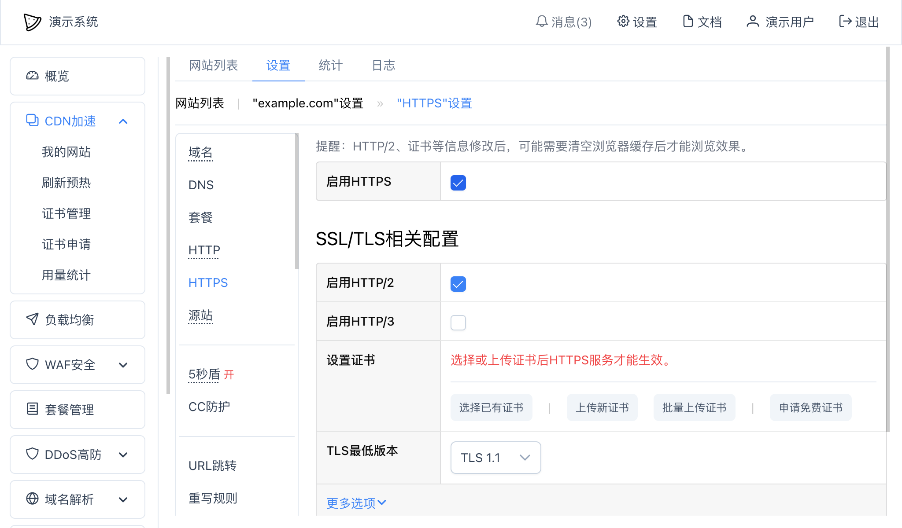

# 网站HTTPS设置
可以使用HTTPS保护网站数据，一个网站需要开启HTTPS设置后才能使用`https://`开头的网址访问。

在网站"设置" -- "HTTPS"里：

* 启用HTTPS：选中后才会启用HTTPS服务；

## SSL/TLS相关设置
* 启用HTTP/2：选中后将支持HTTP/2；
* 选择证书：启用HTTPS后必须上传至少一个证书才能让HTTPS服务生效；证书的域名需要和服务里绑定的域名一致；
* TLS最低版本：选择支持的TLS最低版本；
* 更多选项：
  * 加密算法套件：可以自定义支持的加密套件；
  * 是否开启HSTS：是否支持HSTS，此功能可以让当前域名或者子域名自动从HTTP跳转到HTTPS；详情可以看本文[HSTS](#HSTS)部分；
  * 客户端认证方式：可以设置客户端是否需要证书；
  * 客户端认证CA证书：用来校验客户端证书以增强安全性，通常不需要设置。

## HSTS
可以通过设置HSTS，来强制浏览器使用安全的连接。可以在"SSL/TLS相关设置" -- "更多选项"中开启。开启后，请求HTTPS时会自动发送一个响应Header：
~~~
Strict-Transport-Security: max-age=31536000; includeSubDomains
~~~
之后，所有使用HTTP协议的请求也会自动转到HTTPS，直到HSTS过了有效期（`max-age`）。

如果你在使用Google Chrome浏览器，可以在浏览器上访问：
~~~
chrome://net-internals/#hsts
~~~
来管理HSTS域名。

## OCSP Stapling
可以设置HTTPS服务是否启用OCSP Stapling功能。

### 开启或关闭
可以在网站的"HTTPS"或者"TLS"设置中--"更多选项"--"OCSP Stapling"中开启或者关闭此功能。

### 使用OpenSSL检查链接的OCSP状态
可以使用 `openssl` 命令检查连接OCSP状态：
~~~bash
openssl s_client -connect example.com:443 -servername example.com -status
~~~
可以把其中的两处 `example.com` 都换成你要检查的域名。

返回内容中如果包含了：
~~~
OCSP response: 
======================================
OCSP Response Data:
    OCSP Response Status: successful (0x0)
    Response Type: Basic OCSP Response
    Version: 1 (0x0)
    ...
~~~
就说明服务器成功返回了OCSP。

## 常见问题
### 怎么设置自动从HTTP跳转到HTTPS？
有两种简单方法可以设置自动从HTTP跳转到HTTPS:
* ["HTTP"](http.md)设置 -- "自动跳转到HTTPS"；
* ["URL跳转"](redirect.md) 设置里添加一个跳转规则。

本文前面提到HSTS也可以强制网站从HTTP跳转到HTTPS使用，但通常不建议使用此功能，因为会在用户浏览器上保存设置，导致后期无法很方便地修改。