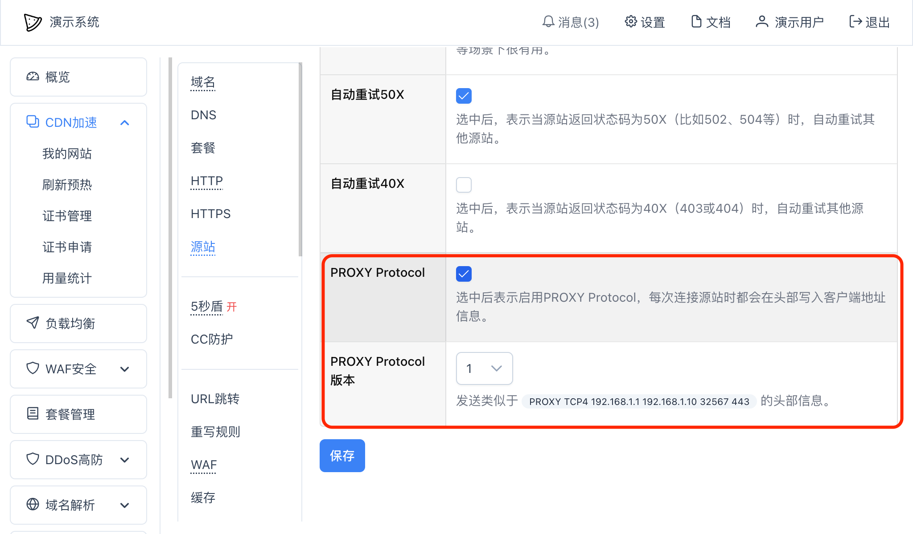

# PROXY Protocol

CDN节点和源站之间可以通过PROXY Protocol功能传递访客的真实IP。

## 设置
在单个网站设置的”源站“ -- “更多设置”页面中 -- “更多选项”中可以选中“PROXY Protocol”一栏中的复选框：

然后保存即可。

其中，一般情况下，不用担心选择哪个版本，通常来说，现代的Web服务都能自动识别。

设置完成后，你需要同时设置源站Web服务，不然源站无法正常访问。

## 源站Web服务设置
启用PROXY Protocol后，你需要在你的源站服务器上的Web服务上也启用PROXY Protocol功能，以nginx为例，可以使用以下配置：
~~~nginx
http {
    ...

    # 在访问日志中需要增加 $proxy_protocol_addr 变量来获取真正的访客地址
    log_format  main  '$proxy_protocol_addr - $remote_user [$time_local] "$request" '
                      '$status $body_bytes_sent "$http_referer" '
                      '"$http_user_agent";

    ...

    server {
        # 在对应监听端口需要增加 proxy_protocol 协议支持
        listen       8080 proxy_protocol;
        ...
    }
}
~~~