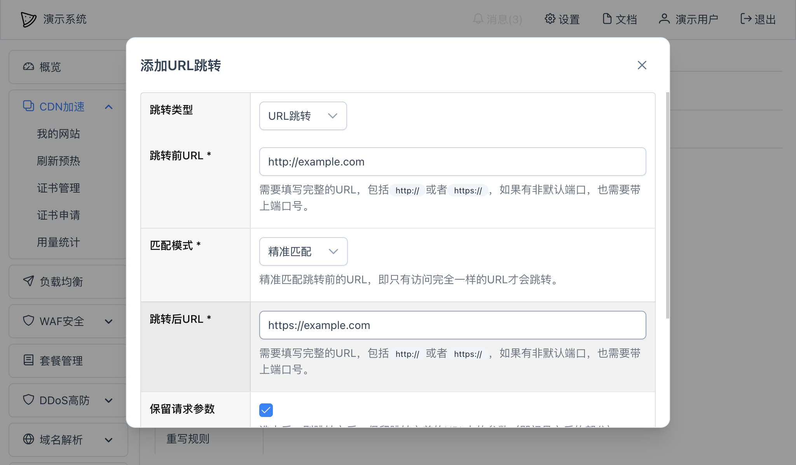

# URL跳转
URL跳转主要允许我们设置不同域名之间的URL跳转。

## 设置跳转
可以在网站"详情" -- "URL跳转"中点击"创建"按钮创建一个规则：

如上图所示：
* 跳转前URL： 跳转之前的URL，需要填写完整的URL，包括`http`或者`https`，如果非`80`或`443`的端口，也需要填入端口；
* 匹配模式：
  * 匹配前缀：只要访问的URL头部部分包含跳转前URL，即可跳转；
  * 精准匹配：精准匹配跳转前的URL，即只有访问完全一样的URL才会跳转，即用户访问的URL和我们填入的"跳转前URL"内容一模一样时才会跳转；
  * 正则匹配：可以在跳转前URL中使用正则表达式，然后可以在跳转后URL中使用正则表达式中括号的变量，比如`${1}`、`${2}`等；
* 是否保留URL路径参数：选中后，则跳转之后，保留跳转之前的URL路径和参数，比如跳转前的URL是`http://example.com/docs?v=1`，那么跳转后的URL也会带上`/docs?v=1`而变成`https://www.example.com/docs?v=1`；
* 跳转后URL：系统匹配到跳转前URL之后要跳转到的URL；
* 跳转状态码：跳转时使用的HTTP状态码，通常选择默认就行，默认的HTTP状态码是`307`；
* 匹配条件：如果对跳转前URL匹配还有别的约束条件，可以在这里添加；
* 是否启用：使用启用当前规则。

各个项目填写完成后，点击底部的"保存"按钮即可保存设置。

注意：如果你设置的跳转规则没有起作用，请清空浏览器缓存或者换个浏览器尝试，确认是不是缓存的问题。

## 示例
### 所有端口跳转到单一端口
比如将所有端口号（包括80/443）链接都跳转到某个固定端口（比如 `8888`）
* 跳转前URL：^(?U)(http|https)://(.+)(:\d+)?(/.*)$
* 匹配模式：正则匹配
* 跳转后URL(这里假设你的8888是https）：https://${2}:8888${4} 

不用担心访问 `8888` 时会无限跳转，系统会自动判断跳转前后URL是否一致，如果一致将不会重复跳转。

### 域名跳转
比如跳转前：
~~~
https://example.com/hello
https://example1.com/hello
https://example2.com/hello
~~~
跳转后：
~~~
https://flexcdn.cn/hello
~~~

除了可以将"跳转类型"设置为域名跳转来实现外，还可以使用正则表达式：
* 跳转前URL：`^https://(.+?)/(.*)$`，表达式中的 `^` 符号表示开始，`$` 符号表示结束
* 匹配模式：正则匹配
* 跳转后URL：https://flexcdn.cn/${2}

## HTTP到HTTPS
如果你的应用场景是希望将HTTP都自动跳转到HTTPS，可以在[HTTP设置](http.md)里快速设置。

