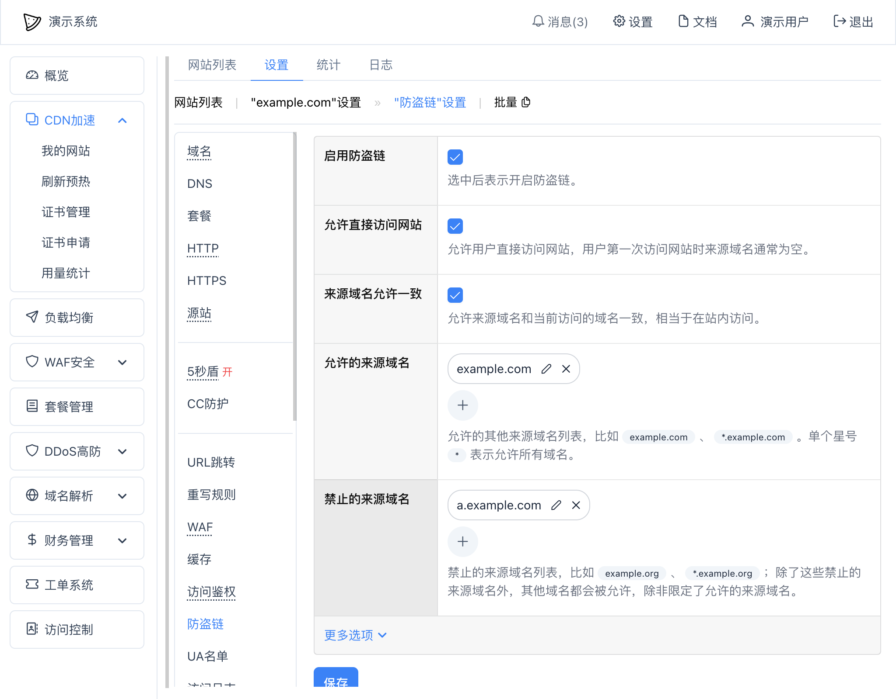

# 防盗链
${DocSystemName}提供了简单的防盗链功能，可以根据请求来源（`Referer`）来决定是否拦截。

## 启用防盗链
在网站设置中 -- "防盗链" 中可以启用防盗链功能：

其中：
* `允许直接访问网站` - 允许用户直接访问网站，用户第一次访问网站时来源域名通常为空；注意：在某些浏览器上（比如Chrome）从HTTPS网站跳转到HTTP网站时可能不会携带来源域名信息
* `来源域名允许一致` - 允许来源域名和当前访问的域名一致，相当于在站内访问
* `允许的来源域名` - 允许的其他来源域名列表
* `禁止的来源域名` - 禁止的来源域名列表；如果一个来源域名既在允许的来源域名中，又在禁止的来源域名中，那么最终将会被禁止

被防盗链阻止后，页面将会提示403，类似于：
~~~
403 Forbidden
The referer has been blocked.

Request ID: 1673496051116481000001.
~~~

如果是中文编码优先的浏览器，将会以中文进行提示。