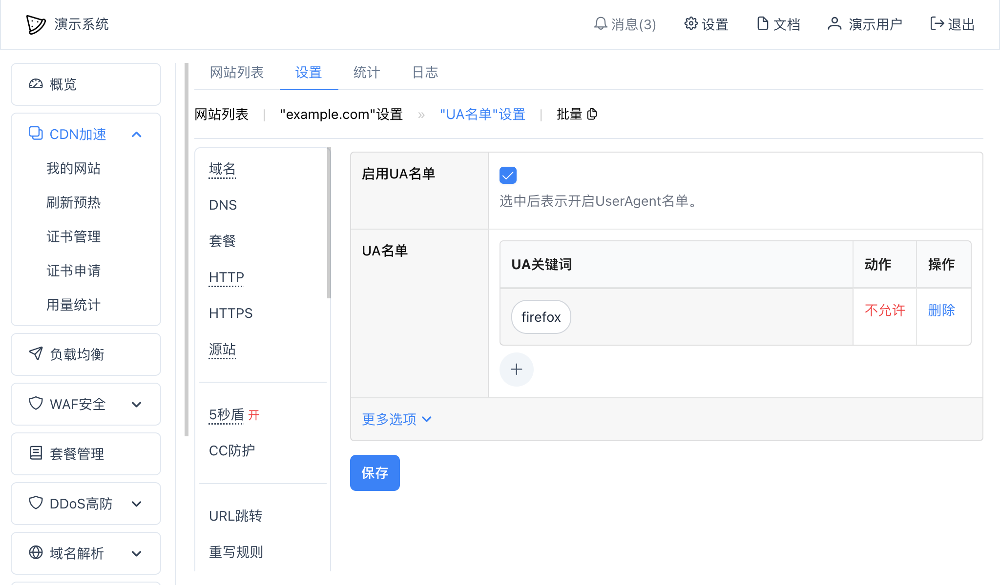
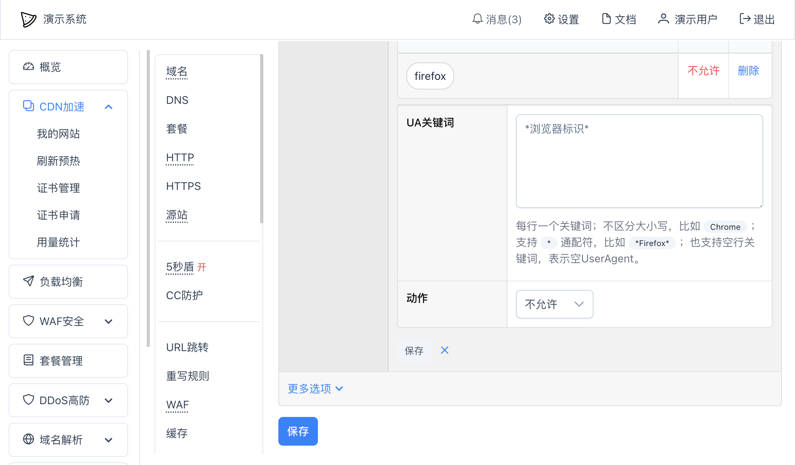

# UserAgent名单
UserAgent名单，简称UA名单，可以根据浏览器或其他客户端发送的`User-Agent`信息决定是否拦截用户请求。

## 启用UA名单
在网站设置中 -- "UA名单"中可以启用UA名单：

点击加号（`+`）可以添加UA关键词：

其中：
* `UA关键词` - 可以是`Chrome`，也可以使用星号（`*`）通配符，比如`*Firefox*`，也可以不填任何内容直接确定，表示空的UserAgent；关键词不区分大小写，即`Chrome`和`chrome`是一样的；
* `动作` - 可以选"允许"或"不允许"，如果是不允许，用此UserAgent访问时就会被阻止；当既有允许的UA关键词，也有不允许的UA关键词时，优先判断"允许"的UA关键词，一旦允许后即不再往下执行

被UA名单阻止后，页面将会提示403，类似于：
~~~
403 Forbidden

The User-Agent has been blocked.
Request ID: 1673496724695481000001.
~~~

如果是中文编码优先的浏览器，将会以中文进行提示。