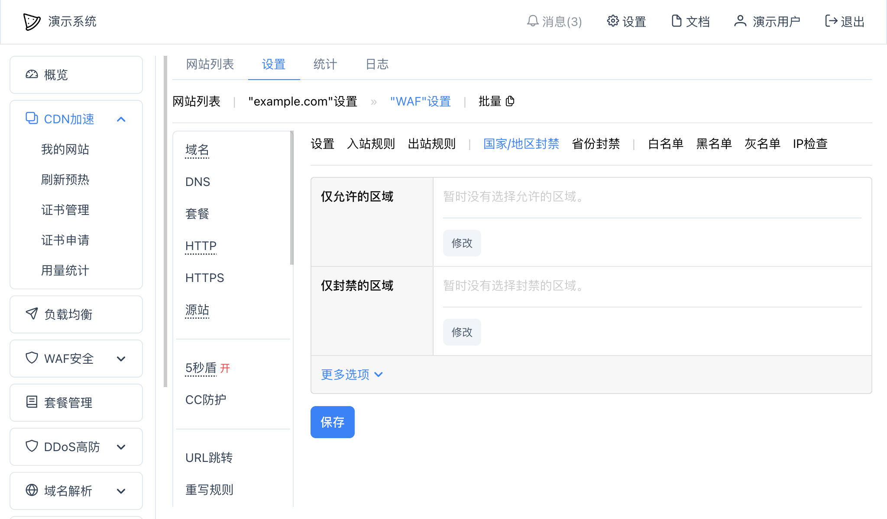
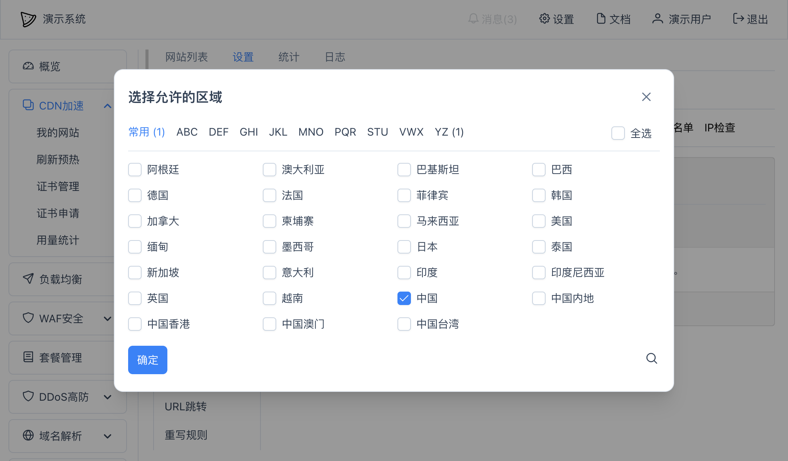
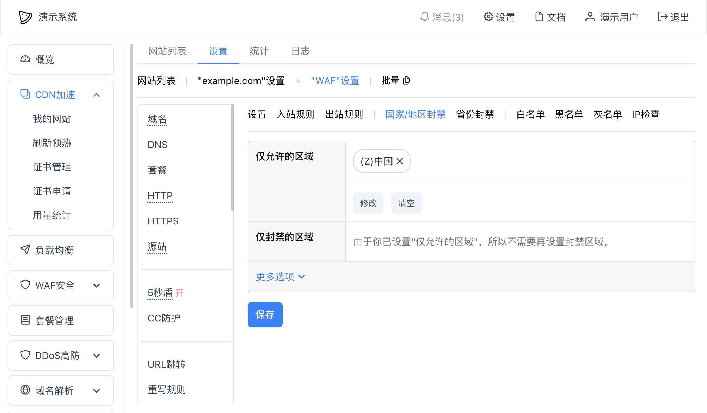
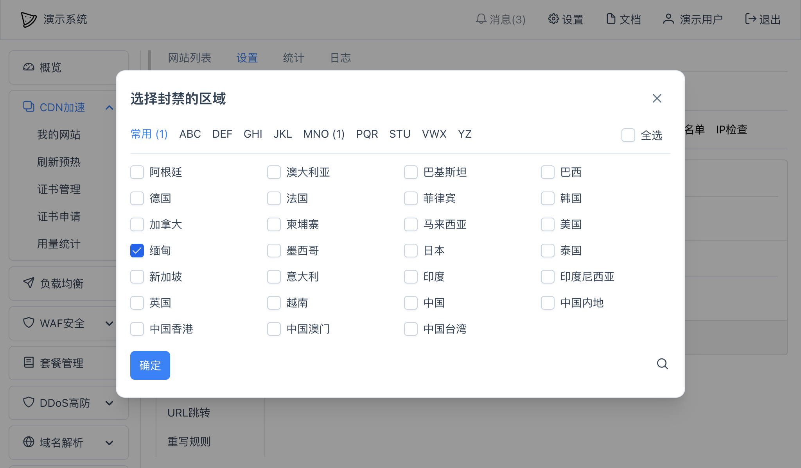
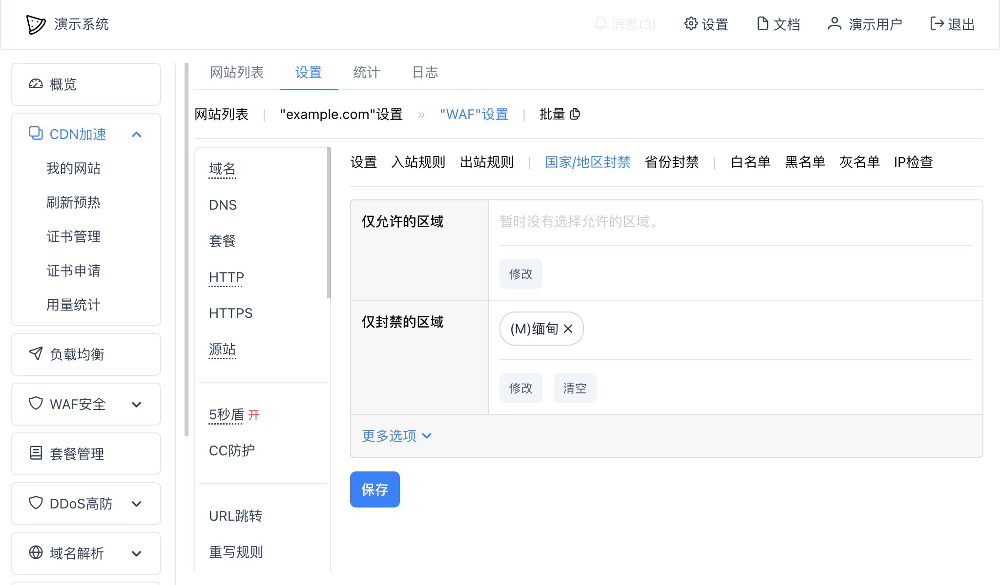

# 国家/地区封禁
可以在WAF中设置只允许一组区域或者禁止一组区域访问我们的网站。

在网站设置 -- "WAF" -- "国家/地区封禁"中可以添加仅允许的区域和仅封禁的区域：

其中：
* `仅允许的区域` - 只有所添加的区域才被允许访问我们的网站；
* `仅封禁的区域` - 只有所添加的区域才被禁止访问我们的网站，其他没有添加的区域都允许访问我们网站；
* 更多选项
  * `例外URL` - 需要排除的URL，在这里配置的URL将不会触发封禁
  * `限制URL` - 只有在限制URL列表里的URL才会触发封禁
  * `提示内容` - 可以设置在用户被封禁时网页上提示的文字，支持完整的HTML（`<html>...</html>`）

上面的`仅允许的区域`和`仅封禁的区域`同时只会有一个有效，以`仅允许的区域`作为优先。

## 示例
### 只允许大中华区访问
大中华区包括中国内地、港澳台，所以可以在"仅允许的区域"中点击"修改"，出现以下界面：

其中，我们选中"中国"，就已经包含了全部大中华区，然后点"确定"：

然后点击底部的"保存"按钮即可。

### 封禁缅甸访问
缅甸是我们随意选取的一个区域，仅供测试使用，可以在"仅封禁的区域"中点击"修改"，出现以下界面：

其中，我们选中"缅甸"，然后点"确定"：

然后点击底部的"保存"按钮即可。
