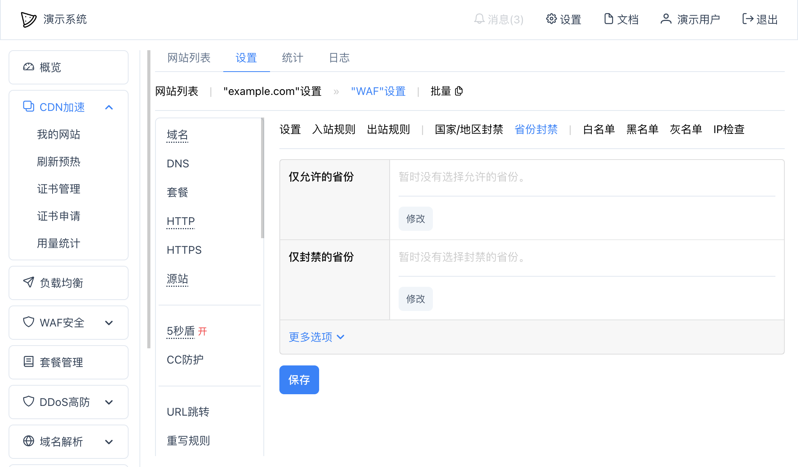
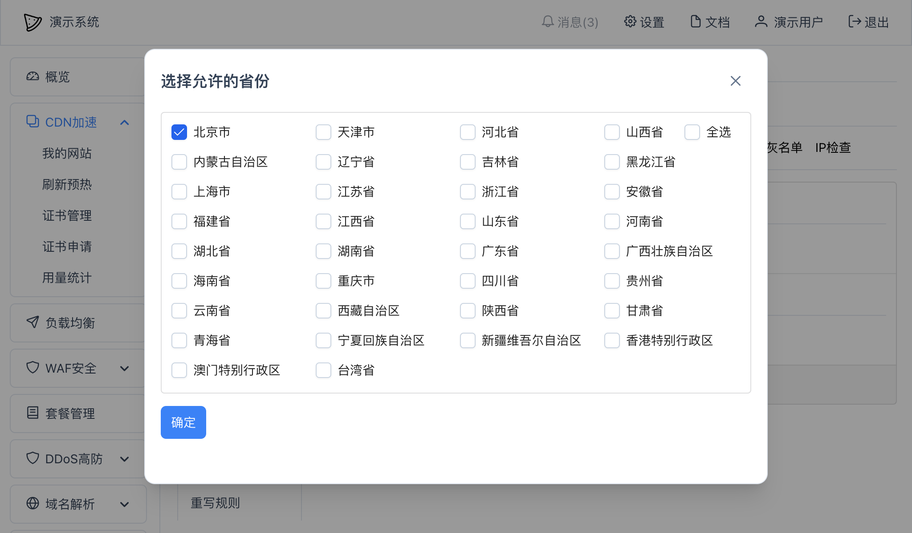
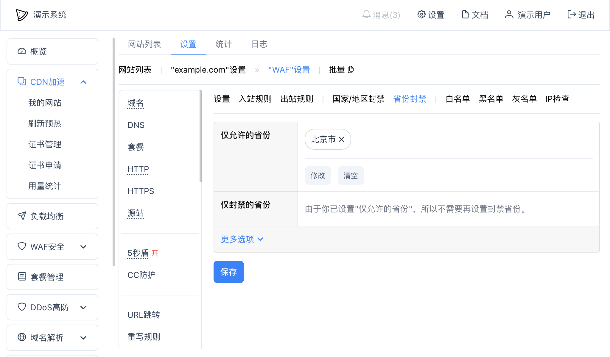

# 省份封禁

可以在WAF中设置只允许一组中国省份或者禁止一组省份（直辖市等）访问我们的网站。

在网站设置 -- "WAF" -- "省份封禁"中可以添加仅允许的省份和仅封禁的省份：

其中：
* `仅允许的省份` - 只有所添加的省份才被允许访问我们的网站；
* `仅封禁的省份` - 只有所添加的省份才被禁止访问我们的网站，其他没有添加的省份都允许访问我们网站；
* 更多选项
	* `例外URL` - 需要排除的URL，在这里配置的URL将不会触发封禁
	* `限制URL` - 只有在限制URL列表里的URL才会触发封禁
	* `提示内容` - 可以设置在用户被封禁时网页上提示的文字，支持完整的HTML（`<html>...</html>`）

上面的`仅允许的省份`和`仅封禁的省份`同时只会有一个有效，以`仅允许的省份`作为优先。

## 示例

### 只允许北京访问
可以在"仅允许的省份"中点击"修改"，出现以下界面：

然后点"确定"：

然后点击底部的"保存"按钮即可。
