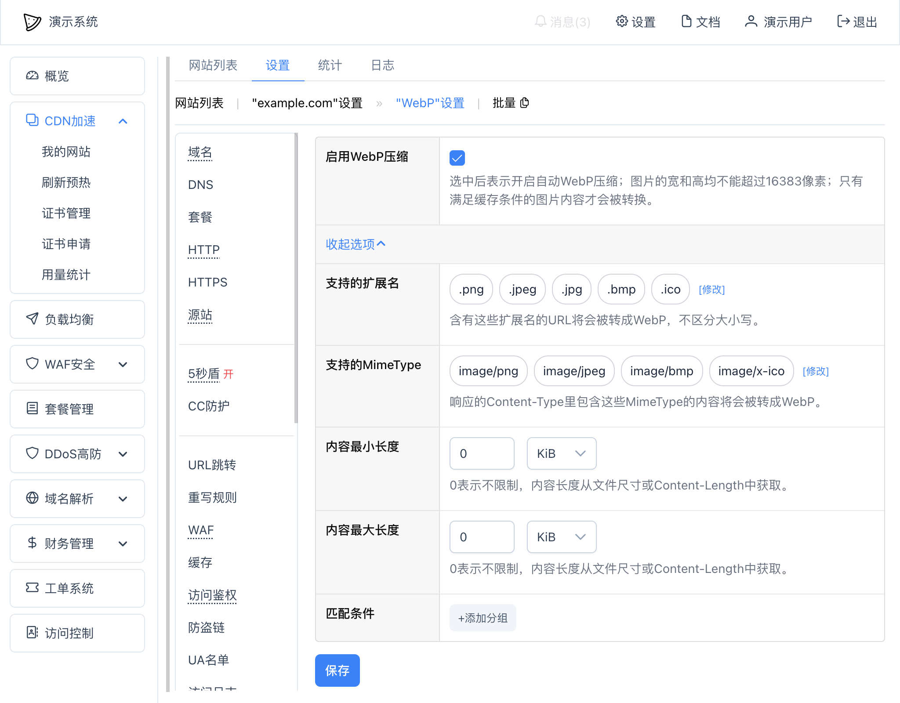

# WebP
可以设置自动将图片转换为WebP，从而大幅减少带宽的使用。

## 设置
可以在网站"设置" -- "WebP"中设置：

其中：
* `启用WebP压缩` - 是否启用WebP转换，注意：只有满足缓存条件的图片内容才会被转换，防止实时转换耗费大量的系统资源；
* `支持的扩展名` - 需要转换的URL扩展名；
* `支持的MimeType` - 需要转换的Content-Type类型；只要一个响应的文件满足扩展名或者MimeType其中之一条件就可以被转换；
* 更多选项：
  * `内容最小长度` - 需要转换的图片内容最小长度；默认没有限制；
  * `内容最大长度` - 需要转换的图片内容最大长度；默认没有限制；
  * `匹配条件` - 额外的匹配条件。

同样的，在单个路由规则中也可以设置WebP自动转换。

设置后，可以在浏览器端查看图片文件的`Content-Type`，如果是 `image/webp` 即为转换成功：
~~~
...
Content-Type: image/webp
...
~~~

WebP转换并不会修改文件的文件名。

## 缓存
由于WebP需要将图片内容全部读取后再转换，消耗了更多的系统资源，所以在开启WebP自动转换后，请同时在缓存设置里开启对图片的缓存，比如缓存`.jpg`、`.jpeg`、`.png`、`.ico`等扩展名的URL。