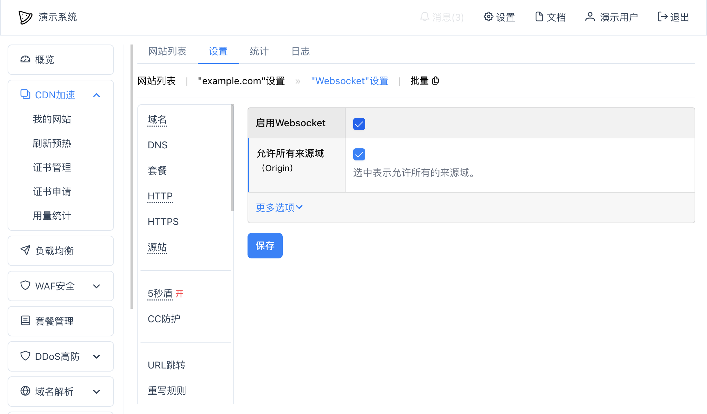

# Websocket
可以在网站"设置" -- "Websocket"里设置是否开启Websocket。

上图中：
* 启用Websocket：启用后，网站才会提供Websocket功能；
* 允许所有来源域：是否允许所有的来源域（`Origin`），如果选中了，表示允许在所有的域名上访问此Websocket；
  * 如果没有选中允许所有来源域，则可以设置允许的域名：
    * 允许的来源域列表：只允许在此列表中的来源域名访问Websocket服务；
* 更多选项：
  * 是否传递请求来源域：选中表示把接收到的请求Header中的`Origin`字段传递到源站。
